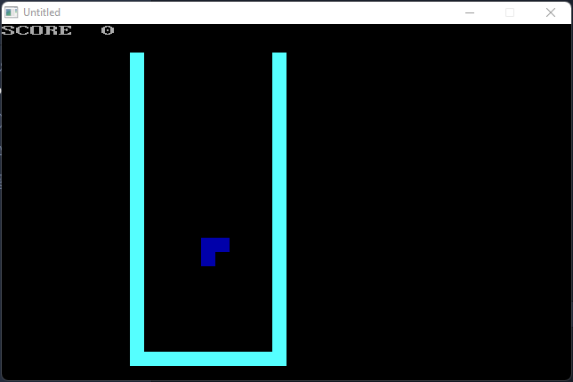
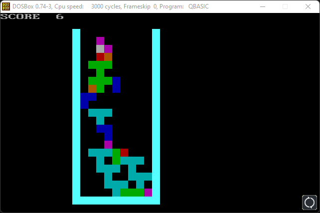
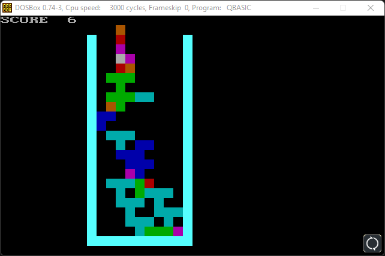
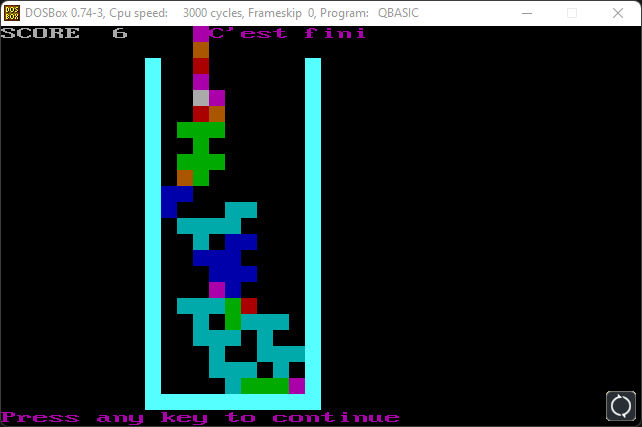

# tetrisbasic
Tétris en basic
Programme de science et vie junior NO 32 de juin 1992.

Il a été conçu pour le qbasic.
Il fonctionne avec [qb64](https://qb64.com/) [github](https://github.com/QB64Team/qb64)

Il fonctionne avec [Basic 2 DOSBox](https://www.qbasic.net/en/qbasic-downloads/DOS/Windows-Solutions.htm)

## Captures d'écran

